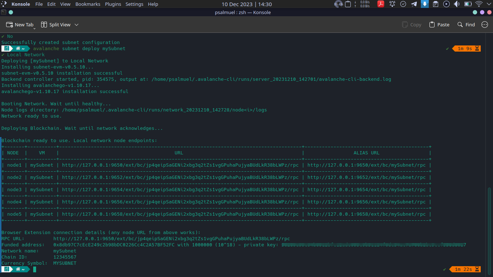
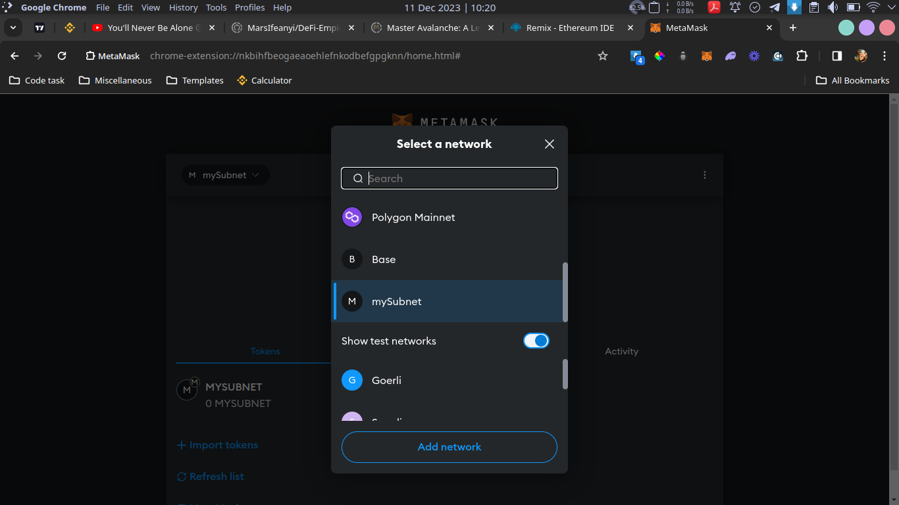

# DeFi Empire

This smart contract allows players to collect, build, and earn rewards for their participation in the game's activities. It has two main contracts, `ERC20 token` contract and the `Vault` contract, which are both deployed on `mySubnet` network.

## Contract Addresses

**ERC20 Token Contract**:

**Vault Contract**:

## Deploying mySubnet Network with Avalanche CLI

## Added mySubnet Network to Metamask

## Deploy/Interact with Remix

<!-- image deploy/interact -->

<!-- 56289e99c94b6912bfc12adc093c9b51124f0dc54ac7a766b2bc5ccf558d8027 -->

### Author

**Samuel Dahunsi**
