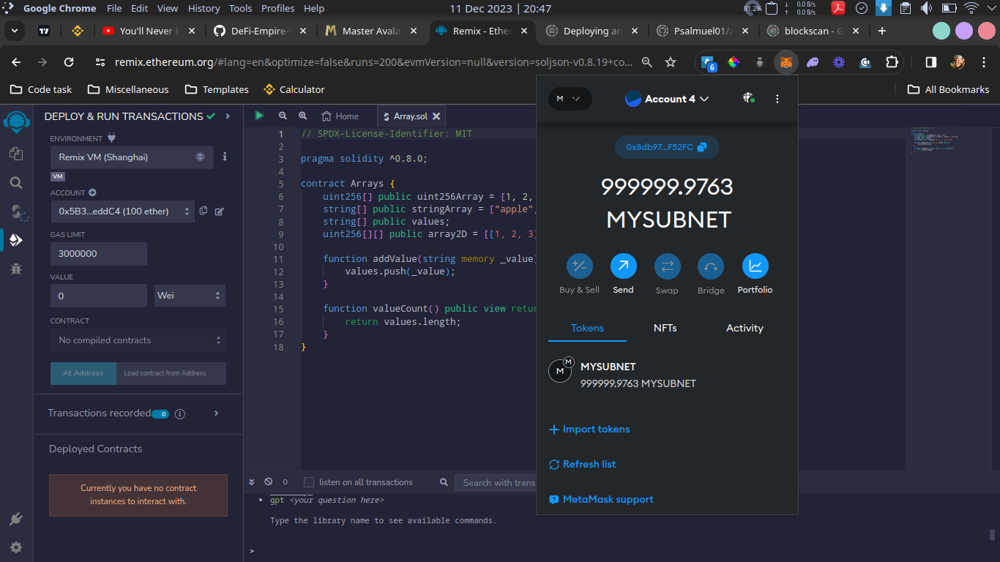
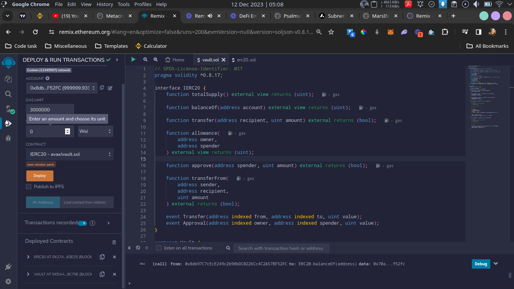

# DeFi Empire

This smart contract allows players to collect, build, and earn rewards for their participation in the game's activities. It has two main contracts, `ERC20 token` contract and the `Vault` contract, which are both deployed on `mySubnet` network.

## Contract Addresses

**`ERC20 Token Contract:`** **0x17aB05351fC94a1a67Bf3f56DdbB941aE6c63E25**

**`Vault Contract:`** **0x5aa01B3b5877255cE50cc55e8986a7a5fe29C70e**

## Deploying mySubnet Network with Avalanche CLI

## Added mySubnet Network to Metamask

## Subnet Details

- `RPC URL`: http://127.0.0.1:9650/ext/bc/jp4qeipSaGENi2xbg3q2tZs1vgGPuhaPujyaBUdLkR38bLWPz/rpc

- `Network name`: mySubnet

- `Chain Id`: 12345567

- `Currency Symbol`: MYSUBNET

## Deploy/Interact with Remix

<!-- image deploy/interact -->

### Author

**Samuel Dahunsi**
